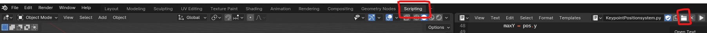

# AutonomousKeypointAnnotation

Blender script that can output a bounding box as well as output coordinates for keypoints relative to the camera.

If you want to use the script as autonomous keypoint annotation for a specific object (Outout is COCO format that is used by YOLOv8), you must follow.

### Step 1 - Open blender

You must open up you blender file, or create a new one. Blender is freely avalible through https://www.blender.org/download/.

### Step 2 - Go to scipt tab

You should navigate to the script tab, and press the folder button to locate the KeypointPositionSystem.py file.
Important that you run the file, otherwise it will not get initialized.

### Step 3 - Setup your target object and place keypoints to be tracked

You will have to modify the script a bit. The script requires a camera (all good if you only have one), collection and object.

Object will be the defintion of your target object. In the example it is the airplane and it defined in line 74 "object = bpy.data.objects['Component#20']"

Collection is the folder inside the blender menu where your keypoints are placed.

You should replace line 92 "kpCollection = bpy.data.collections['Keypoints']" with the collection you have and plece your keypoints inside the folder.

### Step 4 - Path for the output.

You should chance the file*path in line 82, to be your desired file path, omportant that it ends with \aircraft*" + image_file_name + ".txt", to have the same name as the rendered image.

This should be the only adjustments made to use the script.

## Additional files

bbox.py is another included file in the github. This is to check if your output is as expected. You will have to move your renedered output as well as the corresponding .txt file inside the same folder as the script to check the output. e.g. aircraft_0001 for both the label and the image. You can see if the keypoints have been properly projected onto the 2D image.

UnlinkHandlers.py - This one is the unlink the KeypointPositionSystem.py script. Why would you want to do that? Because the scipt will make a new .txt file every time you move to a new frame, and this takes some time and makes the file laggy. So while making the animation for the artificial data, it is a good idea to unlink it.

To relink you just have to run KeypointPositionSystem.py again.

The two .blend files are just examples that we have used.
